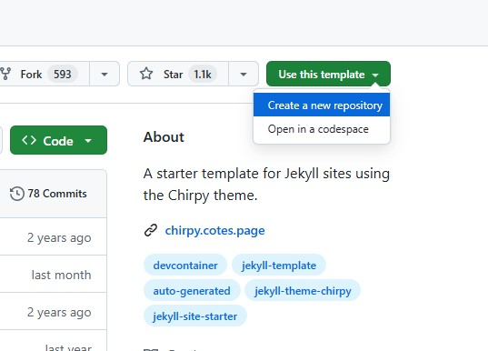
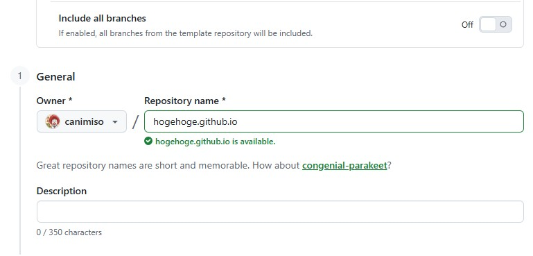
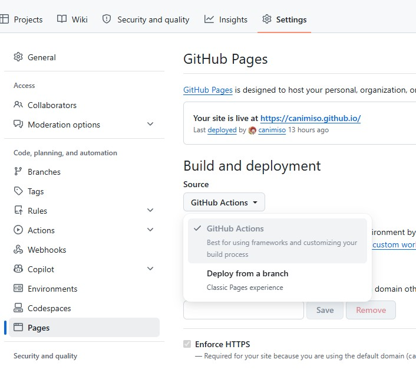

# 簡単な流れ
GitHabにアカウントがあること前提で、

1. まず[https://github.com/cotes2020/chirpy-starter](https://github.com/cotes2020/chirpy-starter)に行き右上の「Use this template」から「Create a new repository」を選択  

2. 1. Repository nameに「`GitHubアカウント名.github.io`」と入れる、Configrationは「public」で  

3. 1. Create repositoryすると必要ファイルが流し込まれたレポジトリが出来上がります。
4. Settings - PagesのBuild and Deploymentを「Deploy from branch」から「**GitHub Actions**」に変更する  

5. `_config.yml`の必要箇所を編集する

> title: ブログのタイトル  
> tagline: タイトル下に表示されるサブタイトル  
> description: SEO的な説明文  
> url: `https://GitHubアカウント名.github.io`

大枠はこれでOKのはず。**Minima**だと必要ファイルを自分で順番に作成する必要があるのでミスったらドツボっぽい流れになりがちなんですけど、**Chirpy**は一通り揃った状態スタートなので起動に持っていくまでは明らかに楽ですね。

あとは`_config.yml`を気が済むまで変更しつつ普段の更新作業用にVSCodeの準備をするくらいです。