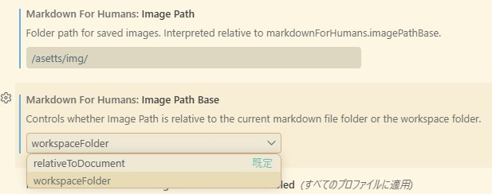

## || 2026/07/23

#### || Markdown for Humans: WYSIWYG Editor

[https://marketplace.visualstudio.com/items?itemName=concretio.markdown-for-humans](https://marketplace.visualstudio.com/items?itemName=concretio.markdown-for-humans)  
GitHub Pagesの更新作業用にMarkdown用のエディタ入れてみた。  
これかなり良い気がする。隣にSource View出して書いてみてもキレイに整形されてるみたいだし、触り心地もObsidian的な感じでとっつきやすい。このエディタで開く時はファイル右クリックで「Open with Markdown for Humans 」から。

画像の初期位置が`/_posts/images`になっているので  
  
Image Pathを`/asetts/img/`、Image Path Baseを`workspaceFolder`に変更しておいた。

#### || インストール中の拡張機能

- Japanese Language Pack for Visual Studio Code
- Markdown All in One
- Markdown Preview Enhanced
- markdownlint
- Markdown for Humans: WYSIWYG Editor

#### || アンインストールした拡張機能

- Typora (メンテが止まっている)
- Markdown Footnotes (Markdown Preview Enhancedに同等機能あり)
- Markdown PDF (Markdown Preview Enhancedに同等機能あり)

#### || 画像の追加方法

左ペインのエクスプローラーへD&DすればOK(現環境なら`/asetts/img/`)。  
Markdownの記法では画像の表示サイズはいじれないのでその場合はhtmlの``タグで貼り付ける。※ただしmarkdownlintは怒ってくる。

#### || コミットメセージ入れ忘れ

メッセージ入れ忘れてコミット作業が動いたままになった場合は、コミット時に開いたタブを閉じれば作業も止まる。その後にメッセージ入れてやり直せば良い。メッセージ欄の横のキラキラマーク「コミット メッセージの生成」のご利用が超おすすめ。

#### || VSCodeのインストール

wingetを使う。

```bash
winget install Microsoft.VisualStudioCode
```

前回(前PC)は [https://code.visualstudio.com/download](https://code.visualstudio.com/download) から `VSCode-win32-x64-1.98.2.zip` をDLして `C:\****\VSCode` に配置したんだけど、ポータブル版だと自動更新が効かないので今回は改めてwingetでインストールした次第。  
winget時にVer1.126、起動して更新の確認したらVer1.129.1、翌日起動したらVer1.130に上がったので自動更新も問題なし。各種設定はおそらく

```plaintext
C:\Users\ユーザー名\AppData\Roaming\Code\User\settings.json
C:\Users\ユーザー名.vscode\extensions
```

にあるのでインストールしなおしても環境はそのまま。
